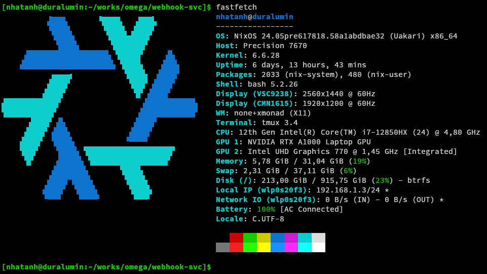
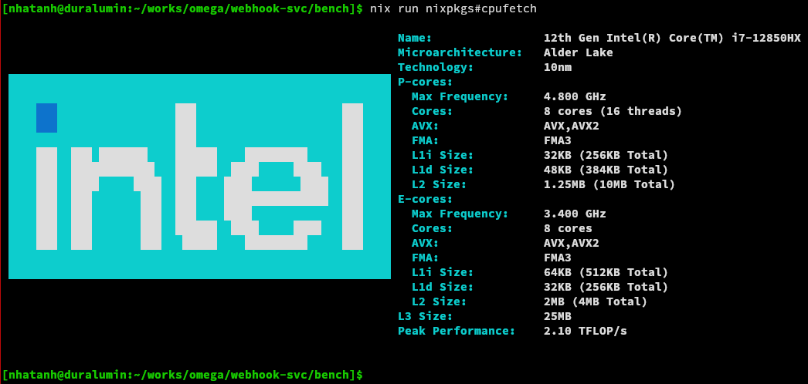
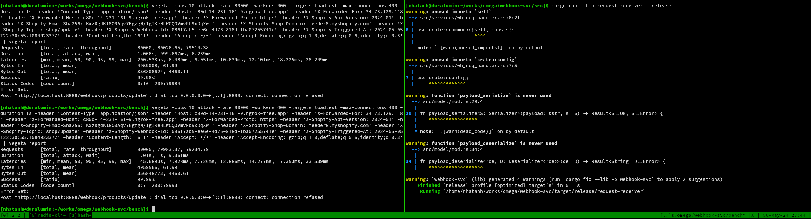
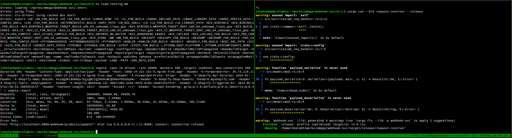
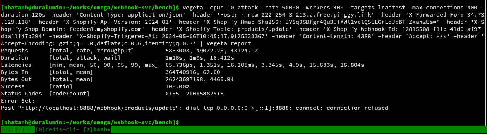

# Load testing
## Background
- The load test was conducted with 2 metrics in mind: (1) the spike throughput (maximum requests successfully handled per second)
  and (2) the maximum sustained load (number of requests per second successfully handled without problem in an extended period) of
  the `request-receiver` - the component under load from Shopify's webhook requests (also malicious actors in the wild that may
  try to DDOS the system) in a specific setup to have a baseline to extrapolate on and estimate performance in other setups.

- An ideal setup for this test would be one machine hosting `request-receiver` receiving requests from the load tester tool
  running on one or more other machines over a high bandwith network (at least 10 Gbps by contemporary standard) so the network is
  not the bottleneck and gets saturated first. Unfortunately because such setup wasn't accessible at an acceptable cost during the
  development of this project, the tester had to settle with a less-than-ideal setup of running both `request-receiver` and the
  load testing tool on the same machine over the loopback interface to circumvent the lack of a high bandwidth network. Since both
  the request handler being tested (`request-receiver`) and the load testing tool share the same processing units, memory and IO
  and both of them would run under extreme condition (the load tester is under load from the server's response too), it's not
  possible to approach the real upper bound of the load `request-receiver` can handle with the test machine's specs. On the other
  hand, since the result is strictly less than the real upper bound, if that result was acceptable then the upper bound would
  definitely be acceptable.

- The target endpoint to be tested is `/products/update` (since in practice it's also the endpoint under the heaviest load),
  defined in the file `loadtest`. The payload used is in `request.json`, and the script `attack.sh` contains an example command to
  run a spike throughput test. The test results below also use the same `loadtest` and `request.json`. If reader wants to
  replicate the test, remember to change the timestamp header `X-Shopify-Triggered-At` to a more recent value, since there's a
  check to rule out outdated requests in the webhook handler.

- The load testing tool of choice was [vegeta](https://github.com/tsenart/vegeta) for its flexible reporting capability and good
  performance, but if you're more familiar with other load testing tool like `ab` feel free to use your own trusted tool, since
  porting the below tests to any http load testing tool should be pretty straightforward. One downside of `vegeta` is how sensitive
  it is to the combination of `cpus`, `workers` and `connections` config when testing at high load.

- `request-receiver` was built with `--release` profile, ran with log level at `error` to minimize the effect of unrelated console
  IO during the test, and connected to `redis` using unix socket as recommended in `README`.

- Test machine specs:

  - There are 24 CPU cores, but in fact there are only 16 performance cores and the remaining 8 cores are economical cores to
    handle less demanding everyday tasks, since this is actually a consumer machine and not a real production server.

## Result
- Spike throughput test:
  - With the above specs, 80k rps seems to be the limit before request drops/requests unable to reach `request-receiver` start toappear.
    Increasing the number of `vegeta`'s workers from 400 to around 450 can push it to 81k, but anymore increase and throughput
    actually regresses. This suggests 80k rps is still not the maximum throughput of `request-receiver` on this test system, just
    the maximum throughput when also running `vegeta` at its limit on the same system.
  - Either way, this should already be more than enough to handle real spike loads from Shopify on a reasonable host not too
    inferior to the test system

- Sustained load test:
  - Sustained load at 50k rps over 60 seconds, no discernable performance degrade

  - The same load over 120 seconds, average throughput degrades to around 43k rps. It seems the only problem is with accummulated
    memory usage by redis, so if the background worker (either `downstreamer` of `kafka_producer`) can offload items stored on redis fast enough and keep memory usage healthy, 40-50k rps load can be sustained for an extended period of time.

